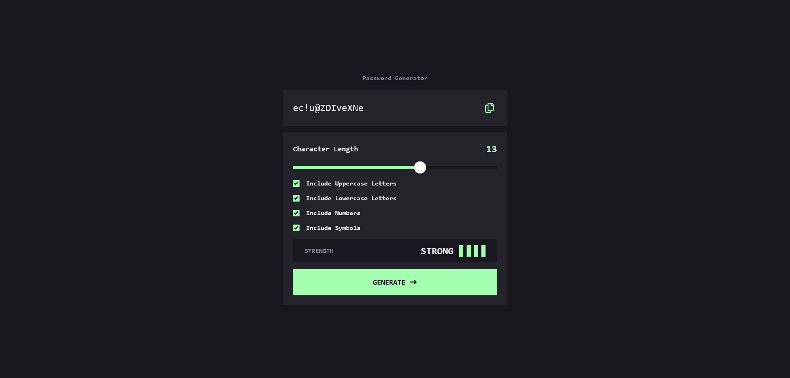

# Frontend Mentor - Password generator app solution

This is a solution to the [Password generator app challenge on Frontend Mentor](https://www.frontendmentor.io/challenges/password-generator-app-Mr8CLycqjh). Frontend Mentor challenges help you improve your coding skills by building realistic projects.

## Table of contents

- [Frontend Mentor - Password generator app solution](#frontend-mentor---password-generator-app-solution)
  - [Table of contents](#table-of-contents)
  - [Overview](#overview)
    - [The challenge](#the-challenge)
    - [Screenshot](#screenshot)
    - [Links](#links)
  - [My process](#my-process)
    - [Built with](#built-with)
    - [Continued development](#continued-development)
    - [Useful resources](#useful-resources)
  - [Author](#author)

## Overview

### The challenge

Users should be able to:

- Generate a password based on the selected inclusion options
- Copy the generated password to the computer's clipboard
- See a strength rating for their generated password
- View the optimal layout for the interface depending on their device's screen size
- See hover and focus states for all interactive elements on the page

### Screenshot

### Links

- Solution URL: [Frontend Mention Solution URL](https://www.frontendmentor.io/solutions/password-generator-app-angular-tailwindcss-typescript-AqJRAPouBD)
- Live Site URL: [Password Generator Hosted on Vercel](https://password-generator-app-sage.vercel.app/)

## My process

### Built with

- [Angular](https://angular.io/) - JS framework
- [Tailwind CSS](https://tailwindcss.com/) - For styles

If you want more help with writing markdown, we'd recommend checking out [The Markdown Guide](https://www.markdownguide.org/) to learn more.

### Continued development

From this point forward I want to utilize the Angular framework. Coming from a React background, I am a big fan of how opinionated Angular has been.

### Useful resources

- [Stack Overflow answer](https://stackoverflow.com/a/51540480/10462660) - This helped me in generating a more secure password, by suggesting the use of Crypto.getRandomValues() rather than using the Math.random() functionality.
- [Crypto](https://developer.mozilla.org/en-US/docs/Web/API/Crypto/getRandomValues) - The MDN docs on Crypto helped give me a deeper understanding on how the API works.
- [Angular Docs](https://angular.io/docs) - I have never built anything with Angular up until this point. In utilizing the docs I was able to understand the lifecycle of components, and how props are passed from parents to children and vice versa.

## Author

- Website - [marioBytes Web Development](https://mariobytes.dev)
- Frontend Mentor - [@marioBytes](https://www.frontendmentor.io/profile/marioBytes)
